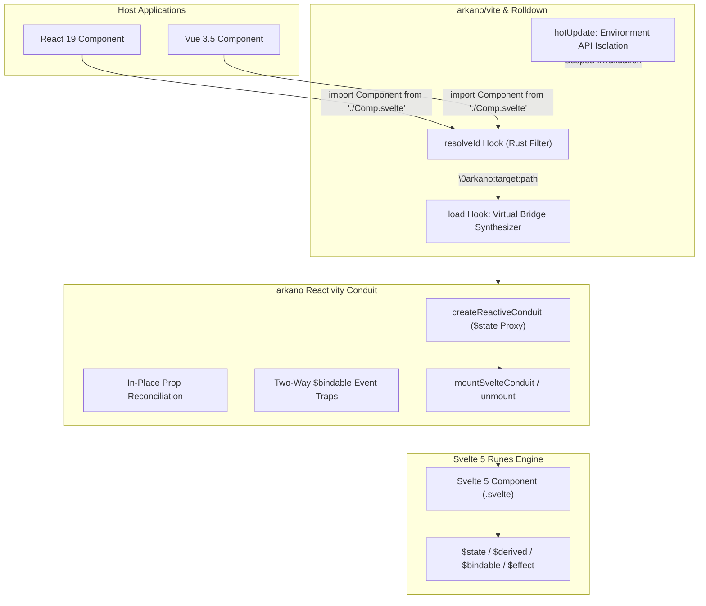

# Arkano

> **Zero-Overhead Transparent Conduit.** Seamlessly inscribe Svelte 5 Runes into
> foreign soil. Import Svelte components directly into React 19 and Vue 3.5 host
> applications with fine-grained reactivity, layout-invisible containers, and
> zero boilerplate.

---

## 🏛️ System Overview

Arkano is a reactivity bridge and compiler plugin that allows
Svelte 5 components (powered by Runes `$state`, `$derived`, `$effect`, and
`$bindable`) to be consumed natively inside React 19 and Vue 3.5 codebases.

- **Zero Legacy:** No codemods, no deprecated wrappers, no migration shims.
  Direct transparent imports only (`import Counter from './Counter.svelte'`).
- **Deno-first Toolchain:** Deno 2 orchestration, Deno Standard Library
  (`@std/*` via JSR), and modern ESM. Vue type checking runs under Node so
  Volar can patch its CommonJS loader and check `.vue` files correctly.
- **Vite 8 & Rolldown Native:** Native Rust hook filters (`rolldown/filter`) and
  Environment API HMR boundary isolation.
- **Fine-Grained Reactivity Conduit:** Dynamic `$state` proxy reconciliation
  preserves object identity and forwards two-way bindings.
- **Invisible Host Containers:** Emits `display: contents` semantic containers
  preserving host layout invariants.

---

## 🏗️ Architecture



---

## 🚀 Transparent Direct Imports

Arkano eliminates wrapper boilerplate. In any React 19 or Vue 3.5 application
configured with `arkano/vite`, simply import your Svelte 5 component directly:

### React 19

```tsx
import Counter from "./Counter.svelte";
import Icon from "./Icon.svelte";

export default function Dashboard() {
  return (
    <div className="flex flex-col items-center gap-4">
      <Icon route="/dashboard" size={24} color="#3b82f6" />
      <Counter initial={10} onCountChange={(n) => console.log("Count:", n)} />
    </div>
  );
}
```

### Vue 3.5

```vue
<script setup lang="ts">
import { ref } from 'vue';
import Counter from './Counter.svelte';
import Icon from './Icon.svelte';

const count = ref(0);
</script>

<template>
  <div class="flex flex-col items-center gap-4">
    <Icon route="/dashboard" :size="24" color="#10b981" />
    <Counter v-model:count="count" />
  </div>
</template>
```

---

## Core Reactivity Engine

1. **`$state` Proxy Conduit:** `createReactiveConduit` instantiates a
   fine-grained Svelte 5 `$state` proxy that reconciles incoming framework props
   in-place without breaking object references or triggering full component
   remounts.
2. **Two-Way `$bindable` Synchronization:** Set traps on the proxy detect
   mutations triggered within Svelte's reactive graph and immediately dispatch
   corresponding framework callbacks:
   - **React:** `on<Prop>Change` (e.g. `onCountChange`) and `onChange`
   - **Vue:** `onUpdate:<prop>` (e.g. `onUpdate:count` for `v-model:count`)
3. **Layout-Invisible Containers (`display: contents`):** Host elements are
   wrapped in configurable HTML tags (default: `span`) with
   `style: { display: "contents" }`, ensuring CSS Grid and Flexbox layouts
   remain pixel-perfect.

---

## Vite 8 & Rolldown Plugin

Arkano composes `@sveltejs/vite-plugin-svelte` with Svelte 5 Runes mode enabled
by default:

```ts
// vite.config.ts
import { defineConfig } from "vite";
import { arkano } from "arkano/vite";
import react from "@vitejs/plugin-react"; // or vue from '@vitejs/plugin-vue'

export default defineConfig({
  plugins: [
    react(),
    arkano(),
  ],
});
```

- **Native Rust Hook Filters:** `resolveId` and `load` leverage Rolldown's
  Rust-native filters (`filter.id`), preventing JS FFI context switches on
  non-Svelte modules.
- **Environment API HMR Isolation:** `hotUpdate` scopes invalidation strictly to
  `this.environment.moduleGraph`, updating only the affected virtual adapter
  boundaries (`\0arkano:*`) without full page reloads.

---

## Quality Verification

| Check                          | Tool / Engine                | Command                                                                                   | Status    |
| :----------------------------- | :--------------------------- | :---------------------------------------------------------------------------------------- | :-------- |
| **Node Compat**                | Deno CLI Bridge              | `deno run -A scripts/cli/main.ts compat`                                                  | Verified  |
| **Unit & Integration Tests**   | Vitest (13 suites, 44 tests) | `deno run -A npm:vitest run --config ./config/vitest.config.ts`                           | 100% Pass |
| **Multi-App Production Build** | Vite 8 + Rolldown            | `deno run -A scripts/cli/main.ts build -A`                                                | Verified  |
| **Library Packaging & Audits** | tsdown + publint + attw      | `deno run -A npm:tsdown --config ./tsdown.config.ts`                                      | Verified  |
| **Core Deno Typecheck**        | Deno Check                   | `deno check src/core/src/index.ts src/vite/src/index.ts src/cli/src/bin.ts`               | Clean     |
| **Svelte 5 Runes Typecheck**   | svelte-check-native          | `deno run -A npm:svelte-check-native --tsconfig ./config/tsconfig.json --threshold error` | Clean     |
| **React 19 Typecheck**         | typescript@6 / tsc           | `deno run -A npm:typescript@6/tsc -p ./config/tsconfig.json --noEmit`                     | Clean     |
| **Vue 3.5 Typecheck**          | vue-tsc                      | `deno run -A npm:vue-tsc -p ./config/tsconfig.json --noEmit`                              | Clean     |
| **Code Health & Dead Code**    | Fallow                       | `deno run -A npm:fallow health --score -c config/fallowrc.json`                           | 100 / 100 |
| **Formatting & Linting**       | Biome 2                      | `deno run -A npm:@biomejs/biome check --config-path=config/biome.json .`                  | Clean     |

## Integration and package checks

The npm package is `arkano`. Public entrypoints are `arkano`, `arkano/react`,
`arkano/vue`, and `arkano/vite`. The `@arkano/*` names in the development workspace
are private aliases and must never appear in consumer code or emitted modules.

Arkano must preserve the canonical `.svelte` module ID for Svelte's extracted CSS.
It bridges local components by default; `include` and `exclude` match resolved
paths. Dependency components under `node_modules` stay native unless explicitly
opted in by overriding `exclude`. `?raw`, `?url`, and Svelte's own queries pass
through. `?arkano-raw` opts out of bridging and resolves to the canonical component.

Vite transforms runtime modules; it does not transform TypeScript's component
types. The legacy `arkano/vite/client` wildcard intersection is insufficient for
React JSX when Svelte's ambient declarations are present. Use framework-specific
declarations for your shared UI entrypoint, keeping prop interfaces shared with
the Svelte sources. Do not use an `any` wildcard to suppress prop checking.

Run `deno run -A scripts/verify-dist.ts` after the distribution build. Before
release, also install the tarball into a consumer without development aliases
and verify type checks, Vitest, a styled component build, and DOM interactions.
The host adapters currently mount Svelte on the client; this is not an SSR or
hydration guarantee, and foreign children/slots require explicit support.
