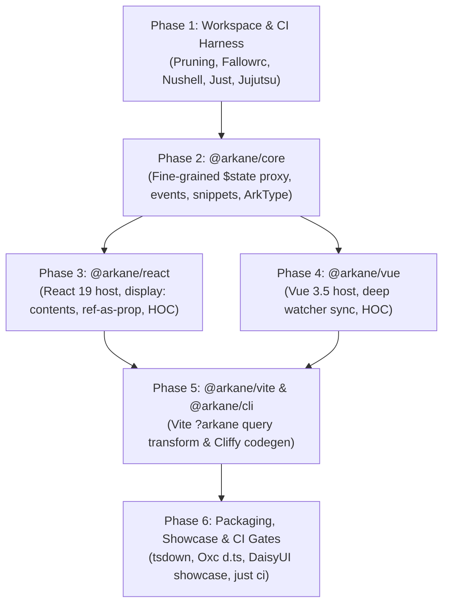

# ⚡ Arkane: Master Orchestration Plan & Phase Index

> *"Inscribe Svelte 5 Runes into foreign soil. Zero-overhead, layout-invisible conduits for React 19 & Vue 3.5."*

This directory contains the **six comprehensive execution specifications** for constructing the Arkane universal conduit monorepo from scratch or migrating it from legacy templates.

---

## 🗺️ Master Phase Architecture & Sequence



---

## 📚 Phase Index & Documentation Links

| Phase | Specification Document | Key Deliverables & Scope |
| :--- | :--- | :--- |
| **Phase 1** | [phase-1-workspace-and-ci.md](./phase-1-workspace-and-ci.md) | • Prunes legacy template (`sdk/api`, `sdk/core`, `sdk/state`, `scripts/cli`).<br>• Preserves `config/fallowrc.json` for `just audit` and `just health`.<br>• Migrates `Counter.svelte` and `Icon.svelte` to `fixtures/components/`.<br>• Establishes `packages/` layout, root `deno.json`, and root `package.json`.<br>• Implements the 5-verb Justfile harness (`dev`, `check`, `test`, `ci`, `deploy`) with Nushell & Jujutsu (`jj`) hygiene. |
| **Phase 2** | [phase-2-core-engine.md](./phase-2-core-engine.md) | • `@arkane/core` package.<br>• `proxy.svelte.ts`: Svelte 5 `$state` proxy conduit with in-place `reconcile()`, key addition, key deletion, and `dispose()`.<br>• `events.ts`: Bidirectional `onClick` $\leftrightarrow$ `onclick` event casing normalizer.<br>• `snippets.ts`: Svelte 5 synthetic Snippet bridge.<br>• `validation.ts`: ArkType development-mode runtime prop validator.<br>• Vitest unit test suite with 100% code coverage. |
| **Phase 3** | [phase-3-react-adapter.md](./phase-3-react-adapter.md) | • `@arkane/react` package (React 19).<br>• `host.svelte.ts`: Layout-invisible `<Arkane />` host container with `display: contents` and direct React 19 `ref`-as-prop.<br>• `adapter.svelte.ts`: `arkane()` and `toReact()` higher-order adapter with full TypeScript prop inference.<br>• Integration tests with `Counter.svelte` verifying zero remounts on prop updates. |
| **Phase 4** | [phase-4-vue-adapter.md](./phase-4-vue-adapter.md) | • `@arkane/vue` package (Vue 3.5).<br>• `host.svelte.ts`: Layout-invisible `<Arkane />` host container with Vue 3.5 `defineComponent`, `watch(deep)`, and `inheritAttrs: false`.<br>• `adapter.svelte.ts`: `arkane()` and `toVue()` higher-order adapter with slot bridging.<br>• Integration tests with `Counter.svelte` verifying deep reactive attribute synchronization. |
| **Phase 5** | [phase-5-vite-plugin-and-cli.md](./phase-5-vite-plugin-and-cli.md) | • `@arkane/vite`: Vite 6+ / Rolldown build-time plugin resolving `?arkane` queries for on-the-fly virtual module wrapping and HMR.<br>• `@arkane/cli`: Cliffy CLI tool (`arkane generate`) for static emit of `.tsx` / `.vue` / `.ts` wrappers with `.d.ts` types. |
| **Phase 6** | [phase-6-packaging-showcase-and-gates.md](./phase-6-packaging-showcase-and-gates.md) | • `tsdown.config.ts`: Multi-entry Rolldown bundling emitting dual ESM/CJS and Oxc isolated declarations (`.d.ts`).<br>• End-to-end integration test with DaisyUI `.join` container and theme cascade.<br>• Complete Quality Gate execution protocol: `just ci` (Biome format/lint, Fallow audit/health, multi-engine types, Vitest, tsdown build). |

---

## 🎯 Master Orchestrator Quality Gate Protocol

Any agent instance implementing these phases must pass the following quality gate sequence:

```bash
# 1. Format and Lint Verification
just fmt-check
just lint-check

# 2. Dead Code & Architecture Health Audit
just audit
just health

# 3. Multi-Engine Type Matrix (Deno + Svelte 5 + React 19 + Vue 3.5)
just types

# 4. Vitest Unit & Integration Behavioral Suite
just test

# 5. Packaging & Compilation
just build

# 6. Convergence Full Gate
just ci
```
