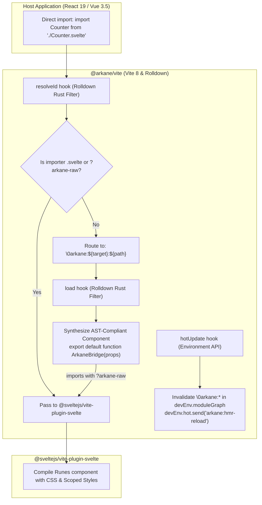

# Execution Plan: Zero-Boilerplate Universal Vite 8 Compiler & Rolldown HMR Orchestrator

> **Document Status:** Executable Blueprint for Implementing Agent  
> **Architecture Reference:** [VITE_PLUGIN_RFC.md](./VITE_PLUGIN_RFC.md)  
> **Toolchain Constraints:** Vite 8.2+ (Environment API), Rolldown 1.2+ (Native Rust Hook Filters), Deno 2+ Workspace, React 19, Vue 3.5, Svelte 5 (Runes)

---

## Architecture Overview



---

## 5-Phase Implementation Sequence

### Phase 1: Workspace Watcher & Monorepo Root Anchoring

> [!IMPORTANT]
> This phase eliminates Linux `inotify` file-watching drops when editing shared components in [fixtures/components](./fixtures/components) from within application roots (`apps/react`, `apps/vue`).

- **Target File:** [config/app.config.ts](./config/app.config.ts)
- **Required Changes:**
  1. Import `searchForWorkspaceRoot` from `vite`.
  2. Inside `defineGWA()`, anchor `server.fs.allow` to the monorepo root:
     ```ts
     const workspaceRoot = searchForWorkspaceRoot(import.meta.dirname ?? process.cwd());
     ```
  3. Expand `server.watch.ignored` with negative ignore patterns to guarantee continuous inotify tracking:
     ```ts
     server: {
       fs: {
         allow: [workspaceRoot],
       },
       watch: {
         ignored: ['!**/fixtures/**', '!**/src/**'],
       },
     },
     ```
- **Verification Gate:**
  Run `deno run -A npm:vite dev` inside `apps/react` and verify that modifying [Counter.svelte](./fixtures/components/Counter.svelte) triggers a file-change event in the terminal.

---

### Phase 2: Core `@arkane/vite` Compiler Pipeline (Vite 8 & Rolldown)

> [!TIP]
> Use `rolldown/filter` utilities (`prefixRegex`, `exactRegex`) to ensure filters execute in compiled native Rust prior to crossing the V8/Deno FFI boundary.

- **Target Files:**
  - [src/vite/src/plugin.ts](./src/vite/src/plugin.ts)
  - [src/vite/src/index.ts](./src/vite/src/index.ts)
- **Required Changes:**
  1. Set plugin `enforce: 'pre'` to intercept `.svelte` imports before `@sveltejs/vite-plugin-svelte`.
  2. In `configResolved(resolvedConfig)`:
     - Detect active target framework by inspecting `resolvedConfig.plugins`:
       - If contains `vite:vue` or `@vitejs/plugin-vue` ➜ `target = 'vue'`.
       - If contains `vite:react-babel`, `vite:react-swc`, `vite:react-oxc`, or `@vitejs/plugin-react` ➜ `target = 'react'`.
       - Allow explicit override via `options.target` (`'react' | 'vue' | 'auto'`).
  3. Implement `resolveId` with Rolldown filter:
     ```ts
     resolveId: {
       filter: { id: /\.svelte(\?.*)?$/ },
       async handler(source, importer) {
         // Pass through pure Svelte sub-components or internal raw queries
         if (source.includes('?arkane-raw') || importer?.endsWith('.svelte')) {
           return null;
         }
         // Resolve canonical filesystem path
         const resolved = await this.resolve(source, importer, { skipSelf: true });
         if (!resolved || resolved.external) return null;

         const cleanPath = resolved.id.replace(/\?.*$/, '');
         return `\0arkane:${targetFramework}:${cleanPath}`;
       }
     }
     ```
  4. Implement `load` with Rolldown filter:
     ```ts
     load: {
       filter: { id: prefixRegex('\0arkane:') },
       handler(id) {
         const isReact = id.startsWith('\0arkane:react:');
         const isVue = id.startsWith('\0arkane:vue:');
         const sveltePath = id.replace(/^\0arkane:(react|vue):/, '');
         const rawImport = `${sveltePath}?arkane-raw`;

         if (isReact) {
           return `
             import React from 'react';
             import { Arkane } from '@arkane/react';
             import SvelteComponent from '${rawImport}';

             export default function ArkaneReactBridge(props) {
               return React.createElement(Arkane, { this: SvelteComponent, ...props });
             }
             export * from '${rawImport}';
           `;
         }

         if (isVue) {
           return `
             import { defineComponent, h } from 'vue';
             import { Arkane } from '@arkane/vue';
             import SvelteComponent from '${rawImport}';

             export default defineComponent({
               name: 'ArkaneVueBridge',
               inheritAttrs: false,
               setup(_, { attrs, slots }) {
                 return () => h(Arkane, { this: SvelteComponent, ...attrs }, slots);
               }
             });
             export * from '${rawImport}';
           `;
         }
         return null;
       }
     }
     ```
- **Verification Gate:**
  Update unit tests in [src/vite/tests/plugin.test.ts](./src/vite/tests/plugin.test.ts) to assert:
  - Direct `.svelte` imports from `.tsx` resolve to `\0arkane:react:...`.
  - Sub-component imports with `importer: 'Parent.svelte'` return `null`.
  - Virtual module output emits a valid React Function Component declaration or Vue `defineComponent`.

---

### Phase 3: Environment HMR Boundary Isolation (`hotUpdate`)

> [!WARNING]
> Do NOT use `handleHotUpdate`, `server.moduleGraph`, or `server.ws.send`. In Vite 8, these trigger deprecation warnings or crash in multi-environment runners.

- **Target Files:**
  - [src/vite/src/plugin.ts](./src/vite/src/plugin.ts)
  - [src/vite/src/hmr.ts](./src/vite/src/hmr.ts)
- **Required Changes:**
  1. Implement `hotUpdate(options: HotUpdateOptions)` in `plugin.ts`:
     ```ts
     hotUpdate(options: HotUpdateOptions) {
       const { file, modules, timestamp } = options;
       if (!file.endsWith('.svelte')) return modules;

       const devEnv = this.environment as DevEnvironment;
       if (!devEnv?.moduleGraph) return modules;

       // Find virtual adapters associated with this Svelte file in this environment
       const affectedAdapters = Array.from(devEnv.moduleGraph.idToModuleMap.values()).filter(
         (mod) => mod.id?.startsWith('\0arkane:') && mod.id.includes(file)
       );

       for (const mod of affectedAdapters) {
         devEnv.moduleGraph.invalidateModule(mod);
       }

       // Emit scoped HMR event
       devEnv.hot.send({
         type: 'custom',
         event: 'arkane:hmr-reload',
         data: { file, timestamp },
       });

       // Return affected adapters to prevent HMR from bubbling up to host root
       return affectedAdapters;
     }
     ```
  2. Deprecate legacy `handleArkaneHmr` in `src/vite/src/hmr.ts` or convert it to an environment-aware utility function.
- **Verification Gate:**
  Add a dedicated unit test in [src/vite/tests/plugin.test.ts](./src/vite/tests/plugin.test.ts) simulating `hotUpdate` on a `.svelte` file and asserting module invalidation on the mocked `DevEnvironment.moduleGraph`.

---

### Phase 4: Application Migration & Manual Wrapper Removal

> [!NOTE]
> Once `@arkane/vite` transparently resolves `.svelte` imports, intermediate `src/lib/mod.ts` files and manual `toReact()` / `toVue()` calls are obsolete.

- **Target Files:**
  - [config/app.config.ts](./config/app.config.ts) (auto-register `arkane()`)
  - [apps/react/src/App.tsx](./apps/react/src/App.tsx)
  - [apps/react/src/lib/mod.ts](./apps/react/src/lib/mod.ts)
  - [apps/vue/src/App.vue](./apps/vue/src/App.vue)
  - [apps/vue/src/lib/mod.ts](./apps/vue/src/lib/mod.ts)
- **Required Changes:**
  1. Add `arkane()` to `defineGWA` default plugins in `config/app.config.ts`.
  2. In `apps/react/src/App.tsx`:
     - Replace:
       ```tsx
       import { Counter, Icon, faviconUrl } from "#lib";
       ```
     - With direct component imports:
       ```tsx
       import Counter from "@sdk/ui/Counter.svelte";
       import Icon from "@sdk/ui/Icon.svelte";
       import faviconUrl from "./lib/assets/img/react.svg";
       ```
  3. In `apps/vue/src/App.vue`:
     - Replace:
       ```vue
       import { Counter, Icon, faviconUrl } from "#lib";
       ```
     - With direct component imports:
       ```vue
       import Counter from "@sdk/ui/Counter.svelte";
       import Icon from "@sdk/ui/Icon.svelte";
       import faviconUrl from "./lib/assets/img/vue.svg";
       ```
  4. Deprecate or simplify `apps/*/src/lib/mod.ts` to only export assets.
- **Verification Gate:**
  Run `deno run -A npm:vite build` inside `apps/react` and `apps/vue` to ensure production builds succeed without missing exports.

---

### Phase 5: Regression Testing & Packaging Verification

- **Required Commands:**
  1. **Full Test Suite:**
     ```bash
     deno run -A npm:vitest run --config ./config/vitest.config.ts
     ```
     Ensure all 13+ test suites pass across `core`, `react`, `vue`, `vite`, `cli`, and `showcase`.
  2. **Library Packaging via `tsdown`:**
     ```bash
     deno run -A npm:tsdown
     ```
     Verify that `dist/vite/index.js`, `dist/vite/index.cjs`, and `dist/vite/index.d.ts` are cleanly generated without isolated declaration syntax errors.
  3. **Multi-App Build Gate:**
     ```bash
     deno run -A scripts/cli/main.ts build -A
     ```
     Verify production builds complete for all apps in `apps/`.
